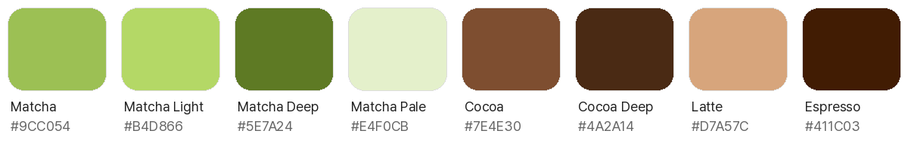

# Hoard

<p align="center"></p>

AI chat app shell by **sleepysoong** — https://github.com/sleepysoong/hoard

Liquid-glass AI chat app (white-first + dark mode). Replies come from
[sleepyrouter](https://github.com/sleepysoong/sleepyrouter); the app ships no sample data
or fake replies — connect the router before sending messages.

## Brand colours



The mascot (app icon) sets the two key colours: **matcha** and **cocoa**.

| Token | Hex | Role |
| --- | --- | --- |
| `HoardMatcha` | `#9CC054` | Fill accent: switches on, success fills (light) |
| `HoardMatchaLight` | `#B4D866` | Matcha on dark backgrounds, secondary (dark) |
| `HoardMatchaDeep` | `#5E7A24` | Matcha-coloured *text* on white (4.9:1), e.g. "연결됨" |
| `HoardMatchaPale` | `#E4F0CB` | Selected pills / tab capsule (`primaryContainer`, light) |
| `HoardMatchaNight` | `#2E3E17` | Selected pills / tab capsule (dark) |
| `HoardCocoa` | `#7E4E30` | Text & icon accent, my bubbles (`primary`, light; 6.9:1 on white) |
| `HoardCocoaDeep` | `#4A2A14` | Text on matcha pills (10.8:1) |
| `HoardLatte` | `#D7A57C` | Cocoa on dark backgrounds (`primary`, dark; 8.9:1) |
| `HoardEspresso` | `#411C03` | Mascot eyes / deepest brown |

Matcha is too light for text on white (2.1:1), so it's used as a fill; text in
the accent colour uses cocoa (or matcha deep). Defined in `ui/theme/Color.kt`, wired in `ui/theme/Theme.kt`.
Still no gradients: every colour is solid.

## What is implemented

- Chat with streaming replies from sleepyrouter, per-message elapsed seconds + token counts
- Routing trace per reply: answering model, tried models, why each failed
- Photo (`PickMultipleVisualMedia`) and file (`OpenMultipleDocuments`) attachments, sent as real content
- Conversations persist across restarts (`data/HoardStore.kt`: one JSON file in app storage, atomic writes,
  debounced + flushed when the app leaves the screen; a corrupt file is kept aside, not overwritten)
- System prompt editing, per-session context limit, session rename/delete
- **Conversation compaction**: `/compact [지시]` manually summarizes older history; automatic
  compaction starts at 90% of the session context limit (설정 → 자동 압축 slider, 50–100% in 5% steps).
  The full visible transcript is retained. Model requests start from the latest successful checkpoint
  plus newer messages; a recent turn is kept verbatim when it fits. Repeated compaction merges the
  earlier summary, while failed or incomplete summaries fall back to ordinary history trimming.
  Tap a checkpoint to read/copy/remove it. Removing the latest checkpoint restores the preceding
  checkpoint (or original history) for subsequent requests, subject to trimming/automatic compaction.
  Context usage reflects this model-facing window. Limits below 4,000 tokens use trimming instead
  of automatic compaction. Design and prompt research: [`docs/COMPACTION.md`](docs/COMPACTION.md).
- Edit my message (save & regenerate), branch from a message, delete message, retry
  - Long-press → **수정** edits in the bottom composer, not a popup. Check saves and regenerates;
    X/Back cancels. Both restore the draft and attachments that were present before editing.
  - Branching while a reply streams marks the copied bubble stopped there — the branch never shows
    a phantom spinner; the original keeps streaming in its own session.
  - Stopping a skill fork's child session cancels the parent turn that owns the fork.
  - Regeneration finishes the old bubble's short exit before inserting the replacement; removed lazy-list
    items are never retained as fading ghosts over the new bubble.
  - Session menu actions retain the selected session ID after closing the menu. Deleting the last session
    leaves an empty list instead of silently creating a replacement session.
  - Stop is available even for a queued/network-waiting reply. It marks streaming bubbles stopped immediately,
    cancels live coroutine/network work directly and cancels the session's persistent WorkManager queue.
- Model replies render as Markdown (`ui/chat/MarkdownText.kt`, [huarangmeng/Markdown](https://github.com/huarangmeng/Markdown)):
  headings, **bold**/*italic*/~~strike~~, lists, task lists, GFM tables, quotes, code blocks with
  highlighting, and LaTeX (`$…$` inline, `$$…$$` block). What I type is shown verbatim.
  Remote images in replies are not fetched (alt text shown instead).
- Web tools (`tools/`), run on the device and offered to the model through sleepyrouter's
  function calling (always on in router mode; Brave key in 설정 → 웹 검색):
  - Flow: `web_search` → 10 results → the model picks the relevant URLs → several `web_fetch` in one turn
    (run in parallel, max 5) → answer from the fetched text. Read-only tools of a round run concurrently;
    side-effect tools (write/edit, termux) run alone in call order.
  - `web_search` — discover pages via the Brave Search API with **the user's own key**
    (none is bundled). Fixed params `text_decorations=false, operators=true,
    result_filter=web,news,faq,discussions` (Q&A cards and forum threads included, not just links);
    `extra_snippets` on, bounded by the normalizer (3 per result, ≤320 chars). Over-fetches
    (shown count + 8, ≤20) and **re-ranks** by query relevance on top of the engine's rank,
    then returns at most 10. `country` / `search_lang` only when the model sets them for a clearly
    local / single-language query (never from the device locale). The description teaches query
    refinement (specific / English terms, `site:`, `"exact"`, `-exclude`, AND/OR/NOT, `filetype:`).
    Output is normalized (`search_1…` ids, `type` web/news/faq/discussion, title/url/source/snippet,
    `extraSnippets`, FAQ `question`/`answer`, `pageAge`, `relatedQueries`, `correctedQuery`, `hasMore`),
    never Brave's raw JSON: URLs deduped across sections (www/host case/trailing slash, `utm_*`/click
    trackers stripped), markup and entities cleaned. 429 retried with backoff honouring `X-RateLimit-Reset`.
    The description tells the model that snippets are not page contents and FAQ answers are unverified.
  - `web_fetch` — read a page: public http(s) only (loopback/LAN/metadata/CGNAT/ULA refused, checked
    on every redirect), `finalUrl` on redirects, size/length caps, main content → Markdown (jsoup).
  - `SearchProvider` interface: Brave is one implementation; Tavily/SearXNG can be added without
    touching the tool schema. Tool loop in `RouterAiEngine`: up to 8 rounds, then `tool_choice: none`.
    Each call appears as a step under the reply's 추론 section.
- `browser_use` — a real Chrome on the user's Ubuntu VPS, driven over SSH + Chrome DevTools Protocol
  (one tool: open / state / click / type / press / scroll / back / forward / reload / tabs / switch_tab /
  close_tab / screenshot; elements addressed by ids from the latest state). Setup and design:
  [Remote browser](#remote-browser-browser_use).
- File tools (always on): `read_file(path, offset?, limit?)`, `write_file(path, content)`,
  `edit_file(path, old_string, new_string, replace_all?)`, `glob(pattern, path?)`,
  `grep(pattern, path?, glob?, case_sensitive?, max_results?)`. Relative paths = the app's private workspace
  (`filesDir/workspace`). Shared storage is also reachable (`/storage/emulated/0`:
  Download, Documents, DCIM…) by absolute path, like a file manager — needs Android's "All files access"
  (`MANAGE_EXTERNAL_STORAGE`, granted in system settings; Android still blocks `Android/data`/`obb`).
  Anything else (`..`, other absolute paths, symlinks out) is refused. UTF-8 text only, atomic writes,
  grep has a 3 s regex budget, glob/grep walks stop at 200k entries / 15 s. Code: `tools/files/`.
- `termux_exec` (always on; needs Termux + its RUN_COMMAND permission): one-shot shell commands in Termux via the official
  `com.termux.RUN_COMMAND` intent to `RunCommandService` (`bash -lc <command>`, background, result back
  through a PendingIntent → `TermuxResultReceiver`). Returns `{stdout, stderr, exitCode}` as-is (non-zero exit
  is a normal result). Distinct errors for: Termux not installed, RUN_COMMAND permission missing,
  `allow-external-apps` not set, timeout. Short commands only (Binder size limit); no PTY/streaming.
  One-time Termux setup: `mkdir -p ~/.termux && echo allow-external-apps=true >> ~/.termux/termux.properties && termux-reload-settings`.
  Code: `tools/TermuxExecTool.kt` (tool layer) ↔ `termux/` (Android side, `TermuxConstants` from termux-shared, compileOnly).
- **Goals** (`goal/`): a thread-scoped persistent completion contract. `/goal <objective>` (or the model's
  `goal` tool, action create/get/complete/block) sets one per session; after each settled turn the
  continuation engine (in `ChatResponseWorker.afterTurn`, outside the agent loop) queues a hidden continuation
   turn while the goal is active and the session is idle (nothing queued, no pending wakeup).
   There is **no fixed turn, token or wall-time cap**: the AI completes the goal with concrete evidence,
    or reports a blocker; the user can stop/pause it. Tool-less automatic turns do not stop continuation.
    Pending user work, scheduled wakeups and failed turns still prevent a duplicate/busy loop. On upgrade,
    active goals parked by the retired idle-turn guard recover automatically. Legacy budget-limited goals can be resumed.
   Goal context is injected as ephemeral developer text, never stored in the
  conversation. Pause/resume/clear are user-only (goal bar → sheet, `/goal pause|resume|clear`); the stop
  button pauses; branching snapshots the goal (`parentGoalId`). Goals persist with the conversation store.
- **Schedules** (`schedule/`): durable `at` / `every` (anchored, no drift) / 5-field `cron` + IANA zone,
  created by the model's `schedule` tool on request. Each firing claims a unique (schedule, planned_at) run,
  applies overlap (skip/queue/parallel) and catch-up (skip/latest/all≤3) policies, and runs in its **own
  isolated session** ("예약 · …") with the prompt (+ optional context snapshot) and the permissions
  snapshotted at creation ∩ current settings (no schedule/wakeup tools inside a run). Run history,
  stale-run recovery and re-arming on app start (`SchedulerEngine.reconcile`). Backend: WorkManager (survives
  reboot; Doze may delay — 15 min grace). `schedule_wakeup` (5 s–1 h, one per session) wakes the same session
  later instead of busy-polling.
- Work steps (reasoning / tool calls, expandable cards) + model picker (router groups/models)
- Session task tracking through one `todo` tool (`create`, `update`, `remove`, `list`, `clear`), with no priorities.
  State lives in one SQLite database keyed by session, independent of chat history. At most one task can be
  in progress; app restart restores tasks, branches copy unfinished work with new IDs, and a new turn gets
  one temporary reminder when unfinished tasks exist. A collapsible glass panel shows committed progress.
  Contract, lifecycle and E2E artifacts: [`docs/TODO_TOOL.md`](docs/TODO_TOOL.md).
- **Agent skills** (`skills/`): Claude Code compatible skill bundles with any router model that supports
  tools. **도구 → 스킬** installs from a GitHub repository or folder URL, or imports a `.zip` / `.skill`
  archive; bundled scripts/references/assets, plugin bundles (`plugin:skill`) and legacy
  `.claude/commands` are kept. Real safe YAML frontmatter, `/name args` and model `skill` invocation,
  `$ARGUMENTS`/`$0`/`${CLAUDE_*}` substitution, `!`command`` dynamic context, saved per-session activations
  that survive restarts, `paths`-scoped activation, and per-turn `disallowed-tools` / `model` / `effort`.
  `context: fork` runs the skill in its own isolated session (`background: true` by default, results
  delivered back and readable with `skill_task`), and skill `hooks` run `PreToolUse`/`PostToolUse`/
  `PostToolBatch`/`Stop`-style bash handlers. Bundled scripts need a trusted-code switch (off by default,
  revoked on any edit) and a digest-verified Termux mirror; Termux cannot read Hoard's private files.
  Model-independent; importing a skill is not installing the Claude Code plugin runtime.
  Installation examples (Ponytail and Binance), prerequisites, security, and the per-field
  compatibility matrix: [`docs/AGENT_SKILLS.md`](docs/AGENT_SKILLS.md).
- No general tool toggles: normal device tools remain offered under their existing permission rules;
  the skill manager does not replace them. At every app launch
  `PermissionGate` asks for what's missing: notifications + Termux RUN_COMMAND (if Termux is installed) in one
  dialog, then Android's "All files access" screen (shared storage for the file tools).
- **Logs**: 설정 → 로그 shows an on-device ring-buffer log (connect checks, reply start/finish,
  failures, cancellations) with copy/clear — secrets (tokens, keys, message contents) are redacted.
- Settings: theme, router (URL/token), default model (typed; blank = router's first group), Brave key,
  **로그 보기** (in-app diagnostic log: 목표/응답/연결 이벤트와 오류, 토큰·키는 자동 마스킹; 복사/지우기),
  remote browser (VPS host / SSH port / user / SSH key / host key check), default context, auto-compaction threshold.
- Top floating bar: session name + live context usage
- Background continuation: replies are produced by a `WorkManager` worker with a
  foreground notification, so leaving the app after send still finishes the reply.
  Always on by design — there is no setting to disable it.
- Liquid glass everywhere via Backdrop 2.0.1 (`drawBackdrop` + `blur` + `lens`),
  glassmorphism fallback on older APIs / preview. **No gradients** — solid colors only.
  How it was built, every pitfall hit and how to verify it: [`LIQUID_GLASS.md`](LIQUID_GLASS.md).
- Signed release APK via `.github/workflows/build-and-release.yml`:
  auto-bumps `version.properties`, tags, and attaches `hoard-<version>.apk` (e.g. `hoard-1.0.61.apk`) to a Release.

## Tool API

Every tool the model can call lives in `app/src/main/kotlin/com/sleepysoong/hoard/tools/` and is assembled
per turn by one entry point, `ToolKit`:

```
ChatResponseWorker
  └─ ToolKit.registry(ToolContext(sessionId, modelId, AndroidToolServices(…), permissions, scheduledRun))
       └─ for each ToolModule in ToolKit.modules → module.tools(context)
  = ToolRegistry ──► RouterAiEngine: schemas() → request `tools`, guidance() → `instructions`,
                                      execute(name, args) in the tool loop (parallel-safe calls concurrently)
```

### Pieces

| Type | Role |
|--|--|
| `Tool` | One function: `name`, `description`, `parameters` (JSON Schema), `execute(args): JsonObject`. Optional: `guidance` (system text while offered), `parallelSafe` (read-only → may run concurrently), `title` / `subject(args)` / `summarize(output)` (the reply's 작업 card). |
| `ToolModule` | A group of related tools: `id` + `tools(context)`. Decides from the context whether its tools are offered this turn. |
| `ToolContext` | One turn's facts: `sessionId`, `modelId`, `services`, `permissions` (a scheduled run's snapshot, else everything), `scheduledRun`. |
| `ToolServices` | Dependencies, lazily created: `searchProvider`, `pageFetcher`, `workspace(fullStorage)`, `termux`, `todos`, `goals`, `schedules`, `wakeups`, `browser`, `skills` (per-turn `SkillRuntime`), `skillTasks` (background fork results). `AndroidToolServices` in the app; `SimpleToolServices(…)` for partial setups. A missing (null) service = its tools aren't offered. |
| `ToolKit` | `modules` (built-in, in offer order) and `registry(context, modules = …)`. `ToolKit.override` replaces the whole registry in tests. |
| `ToolRegistry` | `register(tool)`, `tools`, `schemas()`, `guidance()`, `execute(name, argumentsJson): ToolOutcome` (never throws except cancellation), `preview`, `isParallelSafe`. Skills wire `skillRuntime`, `readOnly` (fork agent policy) and `onWorkspaceFile` (`paths` activation) into it; a skill's `hooks` run inside `execute`. |
| `toolParameters { … }` | Schema DSL: `string(name, description, required, enum, minLength, maxLength)`, `integer(name, description, required, minimum, maximum)`, `boolean(…)`; `additionalProperties = false` by default (`null` omits it). |
| Argument helpers | `args.string(k)`, `args.requireString(k)`, `args.number(k)` / `long(k)` (accept `5`, `5.0`, `"5"`), `args.bool(k)`. |

Built-in modules (`ToolKit.modules`, in this order):

| Module | Tools | Offered when |
|--|--|--|
| `skills` (`SkillModule`) | `skill`, `skill_task` | a `skills: SkillRuntime` service is present; `skill_task` only outside a scheduled run. User slash invocation uses the same runtime |
| `todo` | `todo` | always (session task list) |
| `web` | `web_search`, `web_fetch` | `web_search` only with a search provider (Brave key in Settings) |
| `browser` | `browser_use` | a verified VPS in Settings → 원격 브라우저 (and `permissions.browser`) |
| `termux` | `termux_exec` | always; the call reports if Termux / its permission is missing |
| `files` | `read_file`, `write_file`, `edit_file`, `glob`, `grep` | always; shared storage needs "All files access" |
| `goal` | `goal` | always |
| `schedule` | `schedule`, `schedule_wakeup` | not inside a scheduled run |

The skills service owns bundle installation, safe YAML parsing, trust, path mapping and saved
activations; it never executes repository installer metadata. Rendered skill content persists per
session, but tool denials / model / effort overrides are turn-scoped engine state. Isolated forks run
as their own sessions through `ChatResponseWorker`, and hooks run at the worker/engine boundaries.
See [`docs/AGENT_SKILLS.md`](docs/AGENT_SKILLS.md) for the compatibility matrix and the features that
remain unavailable on mobile.

### Contract every tool follows

- **Output** is a JSON object in the tool's own normalized shape (never a provider's raw response), small enough
  for the model's context (cap long text and say so, e.g. `truncated: true`).
- **Errors** the model should see: throw `ToolException("…")` → it receives `{"error": "…"}` and can adapt. Other
  exceptions become `{"error": "Type: message"}`; cancellation propagates (stop button).
- **Side effects**: leave `parallelSafe = false` (default). Read-only tools set it to `true`; consecutive read-only
  calls of one round run concurrently (max 5), anything else runs alone, in call order.
- **Security**: arguments come from the model — possibly steered by a web page it read. Validate them, keep file
  access inside `Workspace`, network access to public addresses (`PageFetcher`), never bundle API keys.
- **Card text**: `title` is the tool's short Korean name; `subject(args)` the call's target (query, path);
  `summarize(output)` a one-line result. The registry shows failures as `실패: …`.
- **Guidance**: put cross-turn usage rules (when to use it, what to do next) in `guidance`, not in every call.

### Adding a tool

1. Write the tool (next to related ones in `tools/`):

   ```kotlin
   class WeatherTool(private val api: WeatherApi) : Tool {
       override val name = "weather"
       override val title = "날씨"
       override val description = "Current weather for a city. Returns temperature (°C) and conditions."
       override val parameters = toolParameters { string("city", "City name, e.g. Seoul.", required = true) }
       override val parallelSafe = true
       override fun subject(args: JsonObject) = args.string("city").orEmpty()
       override suspend fun execute(args: JsonObject): JsonObject {
           val w = api.current(args.requireString("city")) ?: throw ToolException("unknown city")
           return buildJsonObject { put("tempC", w.tempC); put("conditions", w.conditions) }
       }
   }
   ```
2. If it needs a new dependency, add it to `ToolServices` (nullable), `AndroidToolServices` and `SimpleToolServices`.
3. Add a module (or extend one) and list it in `ToolKit.modules`:

   ```kotlin
   object WeatherModule : ToolModule {
       override val id = "weather"
       override fun tools(context: ToolContext) = listOfNotNull(context.services.weather?.let(::WeatherTool))
   }
   ```
4. Test it without Android: `ToolKit.registry(ToolContext("s", "m", SimpleToolServices(…)), listOf(WeatherModule))`,
   then `registry.execute("weather", """{"city":"Seoul"}""")`. End-to-end through the tool loop: set
   `ToolKit.override` and drive a `FakeRouter` that returns a `function_call` (see `ToolLoopTest`, `ToolKitTest`).

## Remote browser (browser_use)

`browser_use` lets the model drive a real Chrome on the user's Ubuntu VPS. No Chrome extension, no HTTP
proxy: SSH carries everything.

```
Android (Hoard)                                    Ubuntu VPS
┌──────────────────────────────┐                   ┌─────────────────────────────────┐
│ LLM / tool loop              │                   │ X display (Xvfb/XFCE)           │
│  ├─ web_search  (discover)   │                   │  ├─ VNC ── a person watches     │
│  ├─ web_fetch   (read)       │       SSH         │  └─ Chrome (own profile)        │
│  └─ browser_use (interact)   │ ════════════════► │       CDP 127.0.0.1:9222 only   │
│       RemoteBrowserManager   │  exec + -L tunnel │                                 │
│       ├─ SshClient           │                   │ /usr/local/bin/                 │
│       ├─ BrowserRuntimeMgr   │ ── ensure ──────► │   ensure-browser-runtime        │
│       ├─ SshTunnelManager    │ 127.0.0.1:<port> ─► 127.0.0.1:9222                  │
│       └─ BrowserService (CDP)│                   │                                 │
└──────────────────────────────┘                   └─────────────────────────────────┘
SSH = verified secure transport · CDP = AI browser control · VNC = full desktop preview and manual input
```

**Every action** runs the same flow (`browser/RemoteBrowserManager.kt`): SSH connected? (else connect) →
`ensure-browser-runtime` → only `ready: true` continues → tunnel alive? (else a new local forward on a free
port) → CDP connected? (else `GET /json/version` through the tunnel + WebSocket) → action → result. A broken
SSH/tunnel/CDP is rebuilt once, in that order. SSH, tunnel and CDP session stay open between calls and turns
(`RemoteBrowsers`, process-wide); Chrome and its profile (logins, cookies) live on the VPS.

### VPS setup

1. X display + XFCE + VNC (the in-app desktop view/manual input) and Google Chrome or
   Chromium.
2. Install the runtime script (from this repo):

   ```bash
   sudo install -m 755 scripts/vps/ensure-browser-runtime /usr/local/bin/
   ```

   It checks X display → VNC → Chrome → CDP, repairs only what's broken (a dead VNC never restarts Chrome;
   a restarted display re-checks Chrome), judges Chrome by its CDP answer (`/json/version`), waits for CDP
   after a restart and prints one JSON line:

   ```json
   {"ready":true,"display":"running","vnc":"restarted","chrome":"running","cdp":"running","restarted":["vnc"]}
   {"ready":false,"error":"failed_to_start_chrome", …}
   ```

   Chrome is started as `DISPLAY=:0 google-chrome --remote-debugging-address=127.0.0.1
   --remote-debugging-port=9222 --user-data-dir=$HOME/.browser-agent-profile --no-first-run
   --no-default-browser-check` plus a maximized window (`--no-sandbox` only when running as root). As root
   with systemd it runs as its own unit, `hoard-browser.service` (`journalctl -u hoard-browser`), so the SSH
   session that started it ending — or being killed for memory — never takes Chrome along. **CDP is bound to
   127.0.0.1 and must never be exposed**; the app reaches it through the SSH tunnel.
3. Optional `/etc/ensure-browser-runtime.conf` (shell syntax) for your setup, e.g.:

   ```bash
   BROWSER_DISPLAY=":1"                                  # default :0
   DISPLAY_RESTART_CMD="systemctl restart lightdm"       # how to bring the display/XFCE back
   VNC_PATTERN="x11vnc -display :0"                      # how to find the VNC server
   VNC_RESTART_CMD="systemctl restart x11vnc"            # how to restart only VNC
   PROFILE_DIR="$HOME/.browser-agent-profile"
   ```

   Restarting services needs root (or `sudo -n` in these commands).

### App setup (설정 → 원격 브라우저)

1. Host, SSH port (22), user.
2. Login: SSH key (recommended) or password, picked with the SSH 키 / 비밀번호 selector. Key: paste a private
   key (OpenSSH/PEM, no passphrase) or tap **새 키 만들기** (Ed25519, made on the phone) — its public key is
   shown, add it to `~/.ssh/authorized_keys` on the VPS. Password: the VPS's sshd must allow
   `PasswordAuthentication yes`. Both are stored only encrypted with an Android Keystore AES-GCM key
   (`browser/SecretStore.kt`).
3. **연결 확인**: the first time, the app only reads the server's host key and shows its SHA256 fingerprint.
   Compare it with `ssh-keygen -lf /etc/ssh/ssh_host_ed25519_key.pub` on the VPS, then **신뢰하고 연결** pins it
   and runs `ensure-browser-runtime`. Every later connection must present exactly that key (another key
    aborts before authentication; changing host/port un-pins it).
4. VNC port (default 5900) and its existing password, if required. The VNC password is also stored only
   Keystore-encrypted. VNC must be on the **same display** as the CDP Chrome and reachable at VPS
   `127.0.0.1:<VNC port>`; the app forwards it through that same pinned SSH connection, never a public
   VNC endpoint. Use x11vnc's shared mode and key/modifier cleanup (`-shared -forever -clear_keys -clear_mods`).
   Connection checking verifies the runtime **and an actual VNC frame/authentication**, not just a process name.

`browser_use` is offered once host, user, key and the pinned host key are all set.

### Live preview in chat

Calling `browser_use` opens a compact live browser view above the chat input in the invoking session.
Tap it to open full-screen **direct control**; close it or tap **AI 계속** to return control to the AI,
or close the compact view to stop previewing. The complete desktop/Chrome window updates while visible,
including during navigation and between tool calls.

- Full-desktop frames (including Chrome's tab strip, address bar and dialogs) refresh at most ten times
  per second over **VNC in the existing pinned SSH connection**. Slow links
  lower the rate naturally; only one frame request runs at a time, with no queued stale frames. There is no
  extension, exposed CDP port, new HTTP relay, or separate login.
- A five-level quality slider is available in both views. It negotiates the VNC server's Tight/JPEG quality
  and the output JPEG compression (20 / 35 / 55 / 75 / 90), not just display size. Default: level 3
  (55); lower levels reduce transmission size. The selected level is saved across sessions/app restarts.
- Observation never creates tabs, changes focus, runs page scripts or restarts Chrome. A VNC failure is
  shown as a desktop/authentication error; it is **never hidden by falling back to a tab-only capture**.
- Full-screen control supports touch click/swipe scroll, mouse buttons/drag/wheel, hardware keyboard
  and a UI-only text entry with address-bar/Tab/Enter/Esc/delete/select-all buttons. Coordinates account
  for letterboxing and original desktop size, including downsampled images; gutters do not send clicks.
- Manual control waits for the current AI browser action, then exclusively owns the action lock.
  Queued AI browser actions wait without blocking capture and can be cancelled normally. Closing,
  continuing, leaving the chat, or backgrounding releases ownership and held keys/buttons. After handoff,
  CDP re-reads Chrome's actual visible tab and invalidates old element ids before any further input.
- Capture and image decoding stop when the chat is hidden, the app is backgrounded, or the preview is
  dismissed. Image decoding runs off the UI thread and the bitmap size is bounded.
- Preview frames are ephemeral UI data: never saved as chat attachments or sent to the model. The
  explicit `screenshot` action still saves its own image in the workspace as described below.
- Chrome is shared across sessions: only the session most recently invoking `browser_use` gets the
  live preview, so another chat never silently displays its browser work.

### Actions and page state

One tool, one `action` per call: `open(url, new_tab?)`, `state`, `click(element_id)`,
`type(element_id, text, clear?=true, submit?)` (on a `<select>` it picks that option), `press(key)`
(`Enter`, `Escape`, `ArrowDown`, `Control+A`…), `scroll(direction, amount?, element_id?)`, `back`, `forward`,
`reload`, `tabs`, `switch_tab(tab_id)`, `close_tab(tab_id?)`, `screenshot`.

Every action except `tabs`/`screenshot` returns a fresh state, so the model always holds valid ids:

```json
{"action":"click","result":"clicked element 12","tab":{"id":1,"open_tabs":2},
 "url":"https://github.com/login","title":"Sign in to GitHub",
 "elements":[{"id":18,"type":"input","input_type":"email","label":"Username or email address"},
             {"id":21,"type":"button","text":"Sign in"}],
 "more_elements":3,"text":"Sign in to GitHub\nUsername or email address …",
 "scroll":{"y":0,"height":1320,"viewport":1100,"at_top":true,"at_bottom":false}}
```

- Interactive elements (links, buttons, fields, ARIA roles, contenteditable, pointer-cursor elements;
  open shadow roots included) near the viewport get ids; the model never writes CSS selectors or XPath.
- Ids are per document: a navigation makes a new document and new ids, and an old id is refused
  ("the page changed…") instead of hitting another page's element. The same element keeps its id across
  states of one document.
- `text` is the visible text around the viewport (scroll to read more); passwords are never echoed.
  Same-site link hrefs are paths (`/wiki/Foo`), and `open` accepts such a path for the current site.
- Only the newest page state of a turn stays in full: earlier ones lose their element list
  (`Tool.supersede`), so a multi-step task doesn't resend every old snapshot each round.
- Clicks are real mouse events at the element's center (a DOM click if something covers it); a link that
  opens a new tab switches to it. JavaScript dialogs are accepted and reported; downloads go to the VPS
  Chrome's download folder and are reported. `screenshot` saves a JPEG in the workspace (`browser/…`, the
  newest 30 kept); the model gets the path, not the image.
- `open` accepts http(s) only and refuses the server's own loopback/metadata addresses.
- Guidance tells the model: web_search → web_fetch → browser_use (only for JavaScript/SPAs, clicks, forms,
  logins, multi-step navigation, tabs, downloads), never to submit purchases/posts/account changes unless asked,
  and to hand logins/CAPTCHAs it can't finish to the user (VNC).

Code: `browser/` (`SshClient`, `BrowserRuntimeManager` + `SshTunnelManager`, `CdpConnection`, `BrowserService`,
`PageScripts`, `RemoteBrowserManager`, `VncConnection`, `DesktopInput`, `SecretStore`, `SshKeys`), `tools/BrowserUseTool.kt`,
`ui/chat/BrowserDesktopControls.kt`, `ui/settings/RemoteBrowserSection.kt`, `scripts/vps/ensure-browser-runtime`. Libraries: JSch (mwiede) for SSH,
OkHttp for the CDP WebSocket, Bouncy Castle for Ed25519/X25519 on Android.

## Backend: sleepyrouter

Replies come from [sleepyrouter](https://github.com/sleepysoong/sleepyrouter)'s
`POST /hoard/v1/responses` — the OpenAI Responses API plus a routing trace
(`sleepyrouter.routing`: which models were tried, why each failed or was skipped,
which one answered).

1. Run sleepyrouter (default `127.0.0.1:4567`; bind to a LAN/Tailscale address to reach it from the phone).
2. In the app: **설정 → 라우터**, enter e.g. `http://192.168.0.10:4567`, tap **연결**.
   The status shows the router's group/model counts, and the model picker switches to the router's catalog.
   If the router has inbound auth (`[server] auth_token_env`, needed when it listens beyond 127.0.0.1),
   enter the token in **토큰 (선택)** too; it is sent as `Authorization: Bearer …` and stored masked.
3. Chat. Each reply bubble shows `via <answering model> · N개 실패`; tap it for every attempt
   (outcome, HTTP status, error class, duration, reason). Failed replies show the reason instead of an empty bubble.

Attachments are sent as real content with the newest message (`engine/AttachmentEncoder.kt`):
images → `input_image` data URL (photos over 1.5 MB are re-encoded to ≤2048 px JPEG), text/code files →
inlined `input_text`, other files (e.g. PDF) → `input_file`. Files over 10 MB or unreadable ones are
reported to the model instead of silently dropped. Earlier turns only name their attachments.
Whether a model can use `input_file` depends on the provider.

Until the configured router successfully connects, sending (including Alt+Enter), regeneration and
save-and-regenerate are blocked before changing chat history or enqueueing work. The draft and attachments
are preserved, and the composer shows where to connect. Plain HTTP is allowed
(`network_security_config.xml`) because sleepyrouter is a local gateway; note it applies app-wide.

Code: `engine/RouterAiEngine.kt` (HTTP + SSE, request encoding, trace parsing, error
classification), `engine/RouterConnection.kt` (`/v1/models` check + catalog),
`work/ChatResponseWorker.kt` (retries transient failures up to 3 attempts; 4xx are not retried).

## Tests

```bash
scripts/gradlew-lowspec.sh :app:testDebugUnitTest -q --tests '*ReplyOrderingTest' --tests '*ToolLoopTest'
```

Robolectric E2E flows drive the real ViewModel → WorkManager → worker → engine → store
stack. Each test writes a conversation transcript to `app/build/test-artifacts/`.
Run only one or two classes at a time on the low-spec dev machine (see `AGENTS.md`).
GitHub Actions runs the full suite, including a freshly built sleepyrouter, on every push.

Robolectric uses OpenJDK regex, **not Android's ICU regex**. Run
`python3 scripts/check-skill-regex.py` (requires `libicu-dev`) to exercise the actual
skill placeholder/dynamic-command patterns with native ICU. Its evidence is
`app/build/test-artifacts/skill-native-regex.txt`. A bare closing delimiter once
passed all JVM tests but threw `ExceptionInInitializerError` on Android, leaving
chat at `skills loaded ok`. WorkManager captured the error; neither the uncaught
handler nor the stall watchdog reported it. The worker now records the causal
stack and stops the bubble for initialization/linkage failures without retrying.

Publishing an APK is also gated on `NativeChatFlowTest` running in an Android 35
emulator: real WorkManager, tools, HTTP/SSE, two consecutive plain replies with
zero installed skills, and braced/indexed skill substitution plus persisted
context. No test fixture ships in the production app. On a provisioned device,
run `scripts/gradlew-lowspec.sh :app:connectedDebugAndroidTest`; do not start an
unaccelerated emulator on the low-spec dev machine. Release CI preserves Android
test reports, `native-smoke/transcripts.txt` and logcat in the **hoard-native-smoke**
artifact. Transcripts use a dedicated logcat tag so APK uninstall cannot delete them.

- `RouterIntegrationTest`, `RouterUiTest`, `RouterRefreshRaceTest` (stale/overlapping connection probes):
  against fake sleepyrouter servers.
- `AttachmentTest`: attachment encoding including bounded reads (oversize streams are rejected
  before being read to the end).
- `ChatLifecycleFlowTest`: real chat/session menus and composer → WorkManager → HTTP; covers inactive-session
  deletion/rename, sequential regeneration, stop before the first delta/while network queued, immediate resend,
  and offline draft/history preservation. Screenshots and transcripts: `app/build/test-artifacts/chat-lifecycle/`.
- `CompactionFlowTest`: manual/automatic summaries, rejected or incomplete output, checkpoint invalidation,
  and preserving the checkpoint when skill context consumes the history budget.
- `SkillFlowTest`: real local bundles through the tool loop, persisted instructions, user-only invocation,
  code-trust revocation on helper edits, unsafe YAML isolation, and corrupt-registry recovery.
- `WorkerFailureFlowTest`: initial and subsequent class-loading failures finish their
  bubbles, retain causal diagnostics, and never replay side effects automatically.
- `RealSleepyrouterTest` (opt-in): runs the **real** sleepyrouter binary in front of fake upstreams.
  ```bash
  (cd ../sleepyrouter && go build -o /tmp/opencode/sleepyrouter-bin ./cmd/sleepyrouter)
  SLEEPYROUTER_BIN=/tmp/opencode/sleepyrouter-bin scripts/gradlew-lowspec.sh :app:testDebugUnitTest -q --tests '*RealSleepyrouterTest'
  ```
  Skipped when `SLEEPYROUTER_BIN` is unset; CI always sets it.

## Build

Requires **JDK 21** to run Gradle/tests (the Markdown/LaTeX libraries ship Java 21 bytecode;
the app itself still targets Java 17 and D8 handles the rest).

```bash
scripts/gradlew-lowspec.sh :app:assembleDebug
scripts/gradlew-lowspec.sh :app:assembleRelease   # signed with app/release.keystore
```
